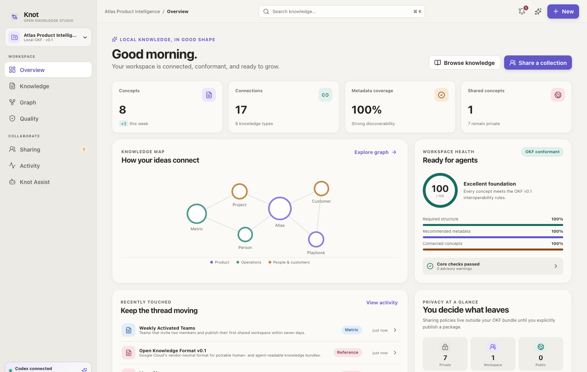
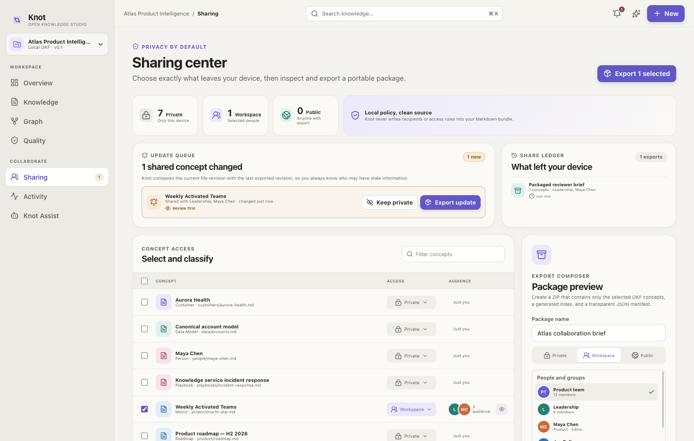
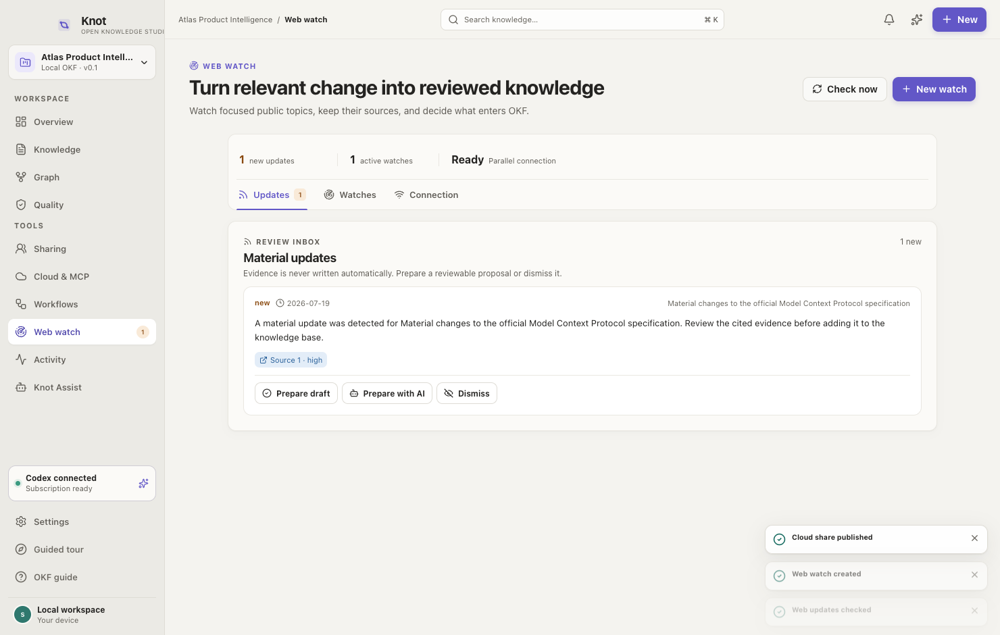
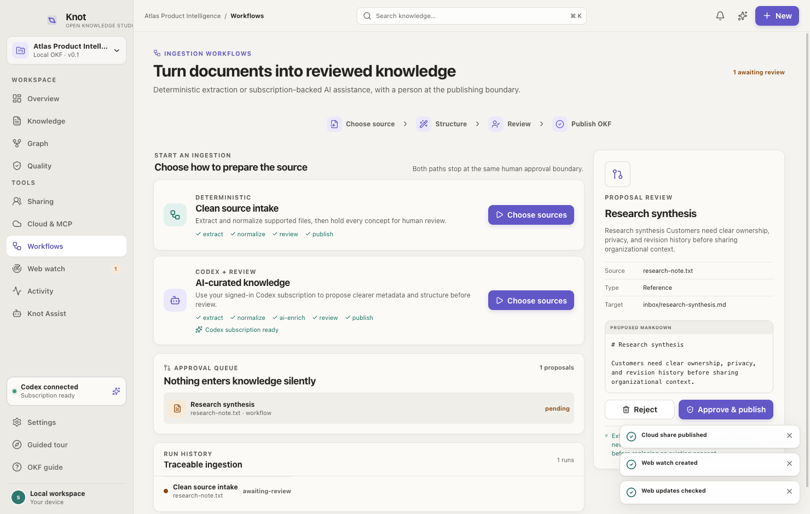

# Knot

Knot is a local-first, cross-platform desktop studio for [Open Knowledge Format (OKF) v0.1](https://github.com/GoogleCloudPlatform/knowledge-catalog/blob/main/okf/SPEC.md). It turns portable Markdown and YAML into a production-grade authoring, validation, graph, selective-sharing, cloud-publication, MCP, and assisted-ingestion workspace without taking ownership of the source format.









## OpenAI Build Week

We built Knot for the **Work & Productivity** track. The problem is simple: open knowledge files are portable, but teams still need a safe way to decide what leaves a workspace, remember which revision somebody received, and let AI agents use the result without giving them uncontrolled write access.

Knot opens an OKF folder directly and keeps the Markdown and YAML as the source of truth. It adds a local control layer for authoring-time privacy, selective publication, recipient-aware update notifications, an auditable sharing ledger, approval-gated ingestion, and scoped MCP access. The included Atlas workspace demonstrates the complete path without requiring a provider API key.

Codex was our engineering partner throughout Build Week. It helped us study the OKF and MCP specifications, turn product questions into explicit trust boundaries, implement the Electron/React application and hosted services, and build adversarial persona tests for collaboration, stale revisions, bearer-capability revocation, proposal conflicts, accessibility, and packaging. GPT-5.6 was especially useful during the release audit: it connected product behavior to protocol and security requirements, challenged assumptions around Daytona stop/wake semantics, and helped reduce those findings to testable invariants rather than optimistic UI copy.

The resulting release gate covers focused unit tests, local and hosted MCP probes, and multi-persona Playwright scenarios. The app is deliberately honest about its limits: named Daytona links are revocable bearer capabilities rather than identity federation, stopped sandboxes do not wake when a link is opened, AI writes are proposals until a person approves them, and researched Notion sync remains a roadmap item rather than a simulated integration.

### Judge path

1. Install Node.js 22+ and npm 10+.
2. Run `npm install`, then `npm run dev`.
3. Use the Atlas sample workspace that opens automatically.
4. Follow the optional guided tour, or open **Graph**, create a private concept, share a selected collection, review the stale-recipient notification, inspect **Web watch** and **Workflows**, then open **Cloud & MCP**.
5. Run `npm run test:ship` for the deterministic release gate.

Core evaluation is local and needs no Daytona, Parallel, or OpenAI API key. Knot Assist is optional and uses an existing signed-in Codex subscription through the local app-server. Cloud publication and live web monitoring are bring-your-own-provider features. The macOS evaluation packages are unsigned; source execution is the most portable judge path.

## Product capabilities

- Open or create a real OKF folder; no import database or proprietary conversion.
- Read, preview, edit, and atomically save concepts while preserving custom frontmatter.
- Validate required frontmatter, `type`, `index.md`, and `log.md` rules.
- Treat broken links and unknown keys permissively, as the specification requires.
- Explore Markdown links as a directed knowledge graph.
- Keep private/workspace/public policy in Knot app data, not in the portable bundle.
- Choose privacy, named people/groups, and update behavior while creating a concept.
- Export an explicitly selected subset as an OKF ZIP with a transparent share manifest.
- Compare current content revisions with the last delivered revision, notify when recipients may be stale, and resolve each update by exporting it or intentionally keeping it private.
- Review an on-device share ledger showing exactly what was exported, when, and for whom.
- Publish a document allowlist to a user-owned Daytona sandbox as either a public portal or one revocable capability link per selected person/group.
- Publish immutable, versioned OKF releases to a Drive/Dropbox/Box-synced folder; the provider supplies durable availability and real account permissions without a running sandbox.
- Export a hardened Docker Compose portal and Streamable HTTP MCP kit for a user-controlled VPS, NAS, or private host.
- Start, stop, auto-stop, sync, and delete the Knot-managed sandbox without exposing the Daytona API key to a share or workspace.
- Serve the selected cloud scope through bearer-protected Streamable HTTP MCP, while serving the complete open local workspace through stdio MCP.
- Give MCP clients read tools for search, concepts, types, and graph traversal; `propose_update` creates a local review item and never edits knowledge directly.
- Ingest Markdown, text, HTML, JSON, CSV, DOCX, and PDF sources through deterministic or Codex-assisted workflows, with preview and explicit human approval before an atomic OKF write.
- Monitor focused public-web topics with Parallel, retain cited update evidence, and choose whether to dismiss, prepare deterministically, or prepare with Codex before normal human approval.
- Use an existing ChatGPT/Codex sign-in through the local Codex app-server. Assistant turns are read-only, network-disabled, ephemeral, and never apply edits automatically.
- Package for macOS, Windows, and Linux with Electron Builder.

## Development

Requirements: Node.js 22+ and npm 10+. Codex CLI is optional and only required for Knot Assist.

```bash
npm install
npm run dev
```

Quality gates:

```bash
npm run typecheck
npm test
npm run build
npm run test:e2e
npm run test:mcp   # local and hosted protocol/security probes
npm run test:ship
npm run test:live-ai  # opt-in real signed-in Codex app-server test
npm run package
```

The Playwright release suite uses isolated Electron profiles and deterministic export paths. It simulates newcomers, authors, editors, reviewers, privacy auditors, durable-folder publishers, self-host operators, cloud owners, named recipients, external MCP agents, conflicting editors, ingestion reviewers, quality stewards, and power users. It restarts the app between collaborators, inspects generated ZIP/deployment/folder releases, probes both MCP transports, scans all major surfaces in three themes for serious/critical WCAG A/AA violations, checks trust boundaries, loads 180 additional concepts, and verifies scrolling and alignment at 1120×720. See [the testing matrix](docs/TESTING.md).

## Daytona cloud sharing

Open **Cloud & MCP**, enter your own Daytona API key, and choose exactly which concepts and audiences belong in the share. The key is encrypted by Electron `safeStorage` using the operating-system credential service; Knot refuses persistent credential storage if that protection is unavailable.

Knot provisions one public-preview Daytona sandbox per local workspace. “Public” controls a human portal route. “Named private links” issues an independent, high-entropy capability URL per chosen label; the names help organize and revoke links but do not verify identity, so anyone holding a link can use or forward it. MCP uses a separate bearer capability, so a copied human link cannot be reused as an agent credential. Revocation updates the hosted allowlist and removes the local encrypted token.

Knot offers an on-demand mode with a 15–120 minute idle stop and an explicit always-available mode that sets auto-stop to zero. Daytona’s current general and SDK documentation disagree about preview activity; a live 80-second probe verified that preview requests currently keep a running sandbox active. A second probe stopped the sandbox, fetched the same link, received `400`, and verified it remained stopped. After a stop, its owner starts it from Knot before links become live again. Automatic wake-on-view would require a durable external wake gateway and is deliberately not simulated. See [integration research and product decisions](docs/INTEGRATIONS.md).

For availability without sandbox compute, the same publication scope can be written to an immutable, versioned synced folder for Google Drive, Dropbox, Box, or another filesystem provider. Provider permissions—not Knot labels—then enforce identity and revocation. **Export deployment** creates a constrained Docker Compose portal and MCP server for a user-owned host. The destination comparison, direct OAuth/object-storage roadmap, and Daytona Windows runner audit are documented in [integration research and product decisions](docs/INTEGRATIONS.md).

## Web watch with Parallel

Open **Web watch**, add your own Parallel API key, and describe only the public-web topic that should remain current. Knot creates a scheduled event-stream monitor, can poll immediately, and retains citations, reasoning, and confidence supplied with each material update. Every result stays in a review inbox. **Prepare draft** is deterministic; **Prepare with AI** uses the existing signed-in Codex subscription; both create the same inspectable workflow proposal and neither writes to OKF before approval. Canceling a watch stops future scheduled usage.

The Parallel key is OS-encrypted and public monitor queries are never populated automatically from private workspace text. A researched Notion projection/sync design—including OAuth, webhooks, block-tree recursion, revision mapping, and conflict handling—is documented in [integration research and product decisions](docs/INTEGRATIONS.md); Knot does not present a tokenless mock as a live Notion integration.

## Agent access through MCP

The **Local MCP** card generates configurations for Codex/ChatGPT desktop and generic MCP clients. Local mode uses stdio and reads the currently open workspace. Cloud mode uses Streamable HTTP and only the documents published in that share.

Available tools:

- `search_knowledge` — ranked title, metadata, tag, and body search.
- `get_concept` — complete concept plus a stable content revision.
- `list_knowledge_types` — scope inventory by type and tag.
- `trace_connections` — bounded traversal of OKF Markdown links.
- `propose_update` — a proposal inbox write; never a knowledge write.

The generated Codex configuration sets `default_tools_approval_mode = "writes"`. Local proposals are read from `.knot/mcp-proposals.jsonl`; that dot-directory is ignored by OKF loading and publication. Cloud proposals are pulled during **Sync now**. Replacing an existing concept requires the proposal’s base revision to still match, preventing an agent from overwriting a newer local edit.

## Architecture

```text
src/main/       Electron boundary, OKF state, encrypted credentials, Daytona/Parallel integrations, workflows, Codex client
src/preload/    Narrow context-isolated IPC bridge
src/renderer/   React application and Radix-based component system
src/shared/     Serializable contracts shared across processes
src/services/   Reusable local stdio MCP and Daytona-hosted Streamable HTTP MCP/share server
tests/          OKF, workflow, MCP, cloud, persona, security, accessibility, scale, AI, and package tests
```

The renderer has no Node.js access. Folder selection, path normalization, atomic writes, ZIP generation, external links, preferences, and Codex processes stay in the main process behind validated IPC calls. Symlinks and dot-directories are not traversed. The BrowserWindow uses context isolation, renderer sandboxing, disabled Node integration, and denied popup navigation.

See [the security model](docs/SECURITY.md) for trust boundaries, hosted authorization, sync invariants, limitations, and response actions.
See [product design decisions](docs/DESIGN.md) for the UI restraint, accessibility, and interaction-promise audit.
See [the release completion audit](docs/RELEASE-AUDIT.md) for requirement-by-requirement evidence and the remaining native Windows gate.

## Product data

- OKF content remains in the user-selected directory.
- Knot preferences, local activity, sharing policy, cloud metadata, and review queues live in Electron's per-user app-data folder.
- The Daytona and Parallel keys plus capability-token plaintext live only in the operating-system encrypted credential vault. App state stores one-way capability hashes.
- Recipient policy, delivery revisions, update notifications, and the local share ledger never modify portable source Markdown.
- A generated ZIP contains only selected concepts, followed dependencies when enabled, `index.md`, and `share-manifest.json`.
- `Auto-prepare` queues the next changed revision for an explicit export; Knot never silently redistributes content.
- Remote knowledge is a revisioned allowlist, never a mirror of the whole workspace. Cloud-side changes enter as proposals; sync never overwrites local Markdown.
- No analytics or Knot-owned cloud service is included.

## Distribution

`npm run dist` produces macOS DMG/ZIP artifacts and the Electron Builder configuration also defines Windows NSIS/portable and Linux AppImage/DEB targets. Public macOS distribution requires a Developer ID certificate and notarization credentials; local unsigned artifacts are suitable for development and internal evaluation only.

## Sources

- [Canonical OKF v0.1 specification](https://github.com/GoogleCloudPlatform/knowledge-catalog/blob/main/okf/SPEC.md)
- [Google Cloud announcement](https://cloud.google.com/blog/products/data-analytics/how-the-open-knowledge-format-can-improve-data-sharing/)
- [Codex app-server documentation](https://learn.chatgpt.com/docs/app-server.md)
- [Codex MCP configuration](https://learn.chatgpt.com/docs/extend/mcp)
- [MCP 2025-06-18 transport specification](https://modelcontextprotocol.io/specification/2025-06-18/basic/transports)
- [MCP security best practices](https://modelcontextprotocol.io/docs/tutorials/security/security_best_practices)
- [Daytona TypeScript SDK](https://www.daytona.io/docs/en/typescript-sdk/)
- [Daytona preview authentication](https://www.daytona.io/docs/en/preview/)
- [Parallel Monitor API](https://docs.parallel.ai/monitor-api/monitor-quickstart)
- [Notion webhooks](https://developers.notion.com/reference/webhooks)

Knot is an independent implementation and is not affiliated with Google Cloud or OpenAI.
